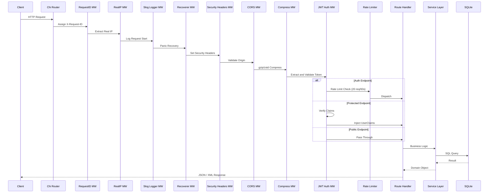
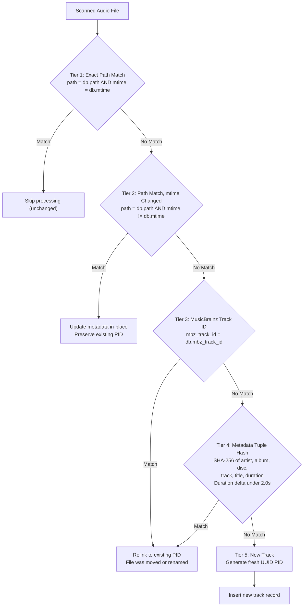
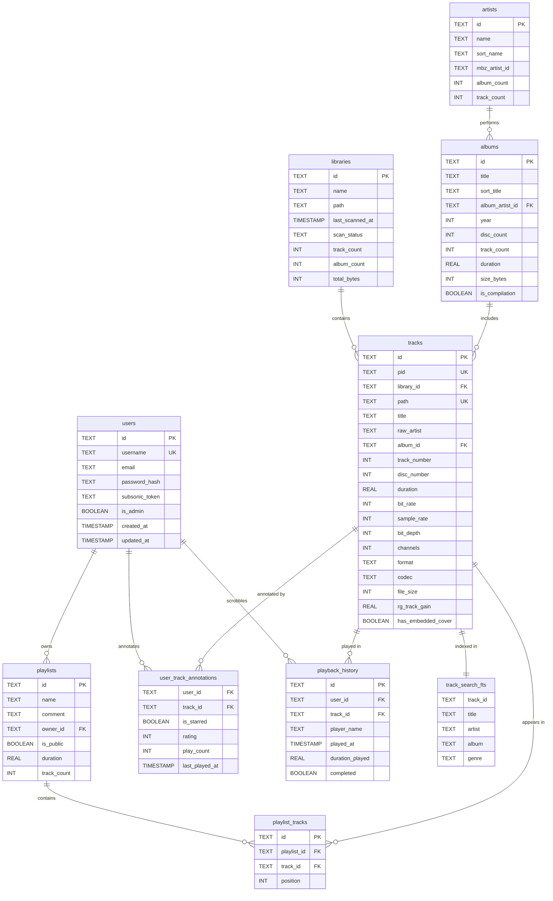
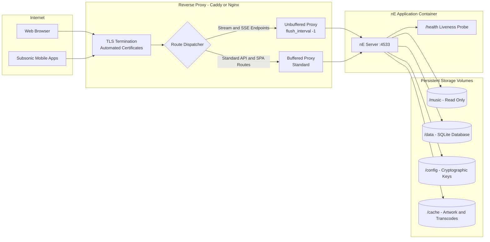

# nE — Autonomous Personal Music Server and Streaming Platform

nE is a modern, lightweight, high-performance self-hosted personal music streaming server and web player engineered for audiophiles. Built with a unified Go backend and an embedded React 19 single-page web player, nE provides zero-dependency deployment, real-time audio transcoding, synchronized karaoke lyrics, dynamic smart mixes, and native mobile streaming support via the OpenSubsonic protocol.

> [!TIP]
> **For the best possible audio fidelity**, use **96 kHz / 24-bit FLAC** source files. nE's Hyperion Studio Pro audio engine is engineered with 32-bit floating-point internal precision and operates at the native sample rate of the source material. At 96 kHz, the Nyquist ceiling extends to 48 kHz — well beyond human hearing — preserving every ultrasonic harmonic the Aural Synthesizer generates in the 16–22 kHz band with zero aliasing. Combined with 24-bit depth (144 dB theoretical dynamic range), this provides the widest possible dynamic headroom for the compressor and limiter stages to breathe naturally without quantization noise.

---

## Table of Contents

- [Features](#features)
- [System Architecture](#system-architecture)
- [Audio DSP Engine Architecture](#audio-dsp-engine-architecture)
- [11-Stage Scanner Pipeline](#11-stage-scanner-pipeline)
- [5-Tier Persistent Identity (PID) Resolution](#5-tier-persistent-identity-pid-resolution)
- [Database Schema](#database-schema)
- [HTTP API Reference](#http-api-reference)
- [OpenSubsonic Protocol (/rest/*)](#opensubsonic-protocol-rest)
- [Quickstart (Local)](#quickstart-local)
- [Docker Deployment](#docker-deployment)
- [Production Deployment Architecture](#production-deployment-architecture)
- [Cloud Deployment (Render)](#cloud-deployment-render)
- [Mobile App Connection Guide (Subsonic)](#mobile-app-connection-guide-subsonic)
- [Configuration Reference](#configuration-reference)
- [CLI Diagnostic Utilities](#cli-diagnostic-utilities)
- [Project Structure](#project-structure)
- [Recommended Audio Formats](#recommended-audio-formats)
- [Legal and Trademark Disclaimer](#legal-and-trademark-disclaimer)
- [License](#license)

---

## Features

### Three-Tier Master Audio Engine (Direct, Broadcast, Hyperion Pro)
nE includes a built-in 32-bit floating-point Web Audio API digital signal processing (DSP) mastering pipeline featuring three distinct switchable engines:
* **Direct (Bit-Perfect)**: 100% clean, uncolored, bit-perfect pass-through with flat frequency response for external DAC purists.
* **Broadcast Master**: Calibrated to international broadcast standards (EBU R128 / -14 dB LUFS) with a 10-band acoustic profile, sub-bass transient punch, and master bus soft-knee dynamic compression.
* **Hyperion Studio Pro**: Flagship audiophile processing chain engineered for high-fidelity reference monitoring:
  * **24-Bit Dynamic Headroom (-16 dB LUFS)**: Preserves dynamic breathing room and natural transient attack.
  * **Aural Harmonic Synthesizer**: Uses non-linear polynomial wave-shaping ($f(x) = x + 0.35x^2 - 0.25x^3$) to synthesize musical 2nd and 3rd order overtones into the **16 kHz – 22 kHz** band, restoring high-frequency presence and acoustic air.
  * **Sub-Harmonic Bass Extender**: Tightens fundamental sub-frequencies (< 65 Hz) via `tanh(1.5x)` soft-clipping without mid-bass mud.
  * **Binaural Spatial Soundstage Matrix**: Employs psychoacoustic Haas micro-delays (12ms) with `ChannelSplitterNode` and `ChannelMergerNode` cross-feed to project instruments into an open three-dimensional soundfield without comb-filtering phase cancellation.
  * **-1.0 dBTP True-Peak Limiter**: Eliminates digital Inter-Sample Peaks (ISPs) and analog DAC clipping distortion.
* [Read the Full Audio Engine Technical Architecture & Math Guide](docs/AUDIO_ENGINES.md)

### Playback and Streaming
* **Modern Web Player**: Built with React 19, Tailwind CSS, Zustand, Lucide icons, and HTML5 Audio. Supports full queue control, shuffle, repeat, volume adjustment, and seeking.
* **RFC 7233 Byte-Range Streaming**: Low-latency seeking (`206 Partial Content`) for instant scrubbing across audio files of any size.
* **On-the-Fly FFmpeg Transcoding**: Stream lossless FLAC or ALAC files seamlessly over cellular connections with automatic conversion to MP3 or Opus, regulated by concurrency semaphores to protect low-RAM server instances.
* **Automatic 401 Token Refresh**: The web player transparently refreshes expired JWT access tokens using HTTP-only refresh cookies without interrupting playback.

### Synchronized Real-Time Lyrics
* **Karaoke-Style Display**: Full-screen blurred artwork overlay with real-time timed lyrics that highlight and scroll automatically with song playback.
* **Dual-Source Auto-Fetching**:
  1. Checks for local `.lrc` files in album directories (e.g., `Track 01.lrc`).
  2. Falls back automatically to the public LRCLIB database and caches lyrics locally.
* **Interactive Seeking**: Click any lyric line to jump directly to that timestamp in the song.

### Dynamic Smart Playlists
* **Automated Music Mixes**:
  * **Recently Added**: Newest tracks ingested into the library.
  * **Most Played**: Personal high-rotation songs.
  * **Recently Played**: Listening history deduplicated by track.
  * **Top Rated**: Tracks rated 4 or 5 stars.
  * **Random Mix**: Instant shuffle mix across the entire collection.
* **Custom Playlists**: Create, rename, reorder, and curate custom playlists with continuous position sequencing. Add tracks to playlists directly from the tracklist context menu.
* **M3U/M3U8 Import**: Automatically discovers and syncs `.m3u` and `.m3u8` playlist files from music directories during library scans.

### Artist Biographies and Editorial Metadata
* Fetches artist background stories, summaries, and high-resolution photo portraits via Wikipedia and MusicBrainz without requiring third-party API keys.

### OpenSubsonic Mobile App Compatibility (/rest/*)
Connect mobile devices and stream on iOS, Android, or desktop using standard Subsonic client applications:
* **iOS**: Amperfy, play:Sub, Substreamer
* **Android**: Symfonium, DSub, Substreamer
* **CarPlay and Android Auto**: Supported through compatible Subsonic mobile client applications.

### Resilient Architecture and Library Ingestion
* **11-Stage Ingestion Pipeline**: Extracts metadata (ID3v1, ID3v2, Vorbis Comments, MP4 tags) for FLAC, MP3, M4A, OGG, Opus, and WAV.
* **5-Tier Persistent Identity (PID) Resolution**: When files are renamed or album folders reorganized, play history, favorites, and playlists remain completely intact without data loss.
* **Storage-Offline Safety**: If a USB drive or cloud volume disconnects, the scanner gracefully aborts without pruning tracks.
* **Hot SQLite Online Backup**: Atomic, non-blocking snapshots using SQLite's native `VACUUM INTO` engine.
* **High-Speed FTS5 Search**: Sub-millisecond full-text search across titles, artists, albums, and genres with automatic diacritic normalization (e.g., "Björk" matches "Bjork") and synchronized database triggers.
* **Continuous Library Watcher**: Background goroutine polls registered library directories every 60 seconds, comparing both file count and latest `mtime` modification timestamps to automatically trigger re-scans when new tracks are added or tags are edited in-place.

### Security
* **JWT Authentication**: Access tokens (24h) and refresh tokens (30d) with auto-generated persistent 32-byte HMAC-SHA256 signing keys.
* **IP-Based Rate Limiting**: Authentication endpoints protected with sliding-window rate limiting (20 requests per 60 seconds default) with trusted proxy subnet validation.
* **Admin-Only Ingestion**: Audio file upload endpoint restricted to authenticated administrators with file overwrite prevention.
* **CORS Hardening**: Strict origin-based CORS; disables credential sharing on wildcard configurations.
* **Security Headers**: `X-Content-Type-Options: nosniff`, `X-Frame-Options: DENY`, `Content-Security-Policy`, `Strict-Transport-Security`.

---

## System Architecture

The following diagram illustrates the complete high-level architecture of nE, from the client layer through the HTTP transport, service layer, repository layer, and external integrations.

```mermaid
graph TB
    subgraph Clients["Client Layer"]
        WEB["React 19 Web Player<br/>Embedded SPA"]
        IOS["iOS Subsonic Apps<br/>Amperfy / play:Sub"]
        ANDROID["Android Subsonic Apps<br/>Symfonium / DSub"]
        CARPLAY["CarPlay / Android Auto"]
    end

    subgraph Transport["Transport Layer - Go Chi Router"]
        HTTP["HTTP Server :4533"]
        MW["Middleware Stack<br/>RequestID to RealIP to Logger<br/>to Recoverer to Security Headers<br/>to CORS to Compress to JWT Auth"]
        REST_API["/api/v1/*<br/>RESTful JSON API"]
        SUBSONIC["/rest/*<br/>OpenSubsonic XML/JSON"]
        SPA["/* Catch-all<br/>Embedded SPA Handler"]
        HEALTH["/health<br/>Container Health Probe"]
    end

    subgraph Services["Service Layer"]
        AUTH_SVC["AuthService<br/>Login, Register, Refresh, SubsonicToken"]
        CATALOG_SVC["CatalogService<br/>Libraries, Albums, Artists, Tracks, Search"]
        STREAM_SVC["StreamService<br/>RFC 7233 Byte-Range, FFmpeg Transcode"]
        ARTWORK_SVC["ArtworkService<br/>Embedded, iTunes, Disk Cache"]
        ANNO_SVC["AnnotationService<br/>Stars, Ratings, Scrobbles, History"]
        PLAYLIST_SVC["PlaylistService<br/>CRUD, Reorder, M3U Import"]
        SMART_SVC["SmartPlaylistService<br/>Recently Added, Most Played, Random"]
        LYRICS_SVC["LyricsService<br/>LRC Files, LRCLIB API, Cache"]
        ARTIST_META["ArtistMetaService<br/>Wikipedia, MusicBrainz Bios"]
        GITHUB_SVC["GitHubSyncService<br/>Track Backup, DB Snapshot"]
    end

    subgraph Core["Core Engine"]
        SCANNER["Scanner Engine<br/>11-Stage Pipeline, 4 Parallel Workers"]
        WATCHER["LibraryWatcher<br/>60s Polling, mtime Tracking"]
        TRANSCODER["FFmpeg Transcoder<br/>Semaphore Pool"]
        JWT_MGR["JWTManager<br/>HMAC-SHA256 Signing"]
    end

    subgraph Repository["Repository Layer - SQLite with WAL"]
        USER_REPO["UserRepository"]
        CATALOG_REPO["CatalogRepository"]
        ANNO_REPO["AnnotationRepository"]
        PLAYLIST_REPO["PlaylistRepository"]
        DB[("SQLite Database<br/>WAL Mode, FTS5, Foreign Keys ON")]
    end

    subgraph External["External Integrations"]
        FFMPEG["FFmpeg Binary"]
        LRCLIB["LRCLIB.net API"]
        WIKI["Wikipedia API"]
        MUSICBRAINZ["MusicBrainz API"]
        ITUNES["iTunes Artwork API"]
        GITHUB["GitHub Contents API"]
        FILESYSTEM[("Local Filesystem /music")]
    end

    WEB --> HTTP
    IOS --> HTTP
    ANDROID --> HTTP
    CARPLAY --> IOS & ANDROID

    HTTP --> MW --> REST_API & SUBSONIC & SPA & HEALTH

    REST_API --> AUTH_SVC & CATALOG_SVC & STREAM_SVC & ARTWORK_SVC & ANNO_SVC & PLAYLIST_SVC & SMART_SVC & LYRICS_SVC & ARTIST_META & GITHUB_SVC
    SUBSONIC --> CATALOG_SVC & STREAM_SVC & ARTWORK_SVC & ANNO_SVC & PLAYLIST_SVC

    AUTH_SVC --> JWT_MGR & USER_REPO
    CATALOG_SVC --> CATALOG_REPO & SCANNER
    STREAM_SVC --> CATALOG_REPO & TRANSCODER
    ARTWORK_SVC --> CATALOG_REPO & ITUNES
    ANNO_SVC --> ANNO_REPO
    PLAYLIST_SVC --> PLAYLIST_REPO
    SMART_SVC --> CATALOG_REPO
    LYRICS_SVC --> CATALOG_REPO & LRCLIB
    ARTIST_META --> CATALOG_REPO & WIKI & MUSICBRAINZ
    GITHUB_SVC --> GITHUB & DB

    SCANNER --> CATALOG_REPO & FILESYSTEM & FFMPEG
    WATCHER --> CATALOG_SVC
    TRANSCODER --> FFMPEG

    USER_REPO --> DB
    CATALOG_REPO --> DB
    ANNO_REPO --> DB
    PLAYLIST_REPO --> DB
```



### HTTP Request Lifecycle

Every incoming HTTP request passes through the middleware chain before reaching a handler:



---

## Audio DSP Engine Architecture

The Web Audio API signal chain processes audio through a structured graph of audio nodes:

```mermaid
flowchart LR
    SRC["Audio Element Source Node"] --> PRE["PreAmp Gain Stage"]

    PRE --> EQ1["32 Hz Low Shelf"]
    EQ1 --> EQ2["64 Hz Peaking"]
    EQ2 --> EQ3["125 Hz Peaking"]
    EQ3 --> EQ4["250 Hz Peaking"]
    EQ4 --> EQ5["500 Hz Peaking"]
    EQ5 --> EQ6["1 kHz Peaking"]
    EQ6 --> EQ7["2 kHz Peaking"]
    EQ7 --> EQ8["4 kHz Peaking"]
    EQ8 --> EQ9["8 kHz Peaking"]
    EQ9 --> EQ10["16 kHz High Shelf"]

    PRE -->|"Parallel Tap"| AURAL_HP["Aural Exciter<br/>11 kHz Highpass"]
    AURAL_HP --> AURAL_WS["WaveShaper<br/>x + 0.35x² − 0.25x³<br/>4x Oversample"]
    AURAL_WS --> AURAL_BP["Bandpass<br/>16.5 kHz, Q: 0.9"]
    AURAL_BP --> AURAL_G["Aural Gain<br/>0.38"]

    PRE -->|"Parallel Tap"| SUB_LP["Sub-Bass<br/>65 Hz Lowpass"]
    SUB_LP --> SUB_WS["WaveShaper<br/>tanh(1.5x)<br/>2x Oversample"]
    SUB_WS --> SUB_G["Sub-Bass Gain<br/>0.28"]

    EQ10 --> BUS["Pre-Compressor Summing Bus"]
    AURAL_G --> BUS
    SUB_G --> BUS

    BUS --> COMP["Dynamics Compressor<br/>-18 dB Threshold, 2.2:1 Ratio"]

    COMP --> SPLIT["Channel Splitter (2 Channels)"]

    SPLIT -->|"L Direct"| MERGE["Channel Merger"]
    SPLIT -->|"R Direct"| MERGE
    SPLIT -->|"L to 12ms Delay"| HAAS["Haas Delay 12ms"]
    HAAS --> HAAS_G["Haas Gain 0.22"]
    HAAS_G -->|"Cross-feed to R"| MERGE

    MERGE --> LIM["Brickwall Limiter<br/>-1.0 dBTP Ceiling, 20:1 Ratio"]

    LIM --> FFT["FFT Analyser 256-bin"]
    FFT --> DAC["AudioContext Destination (DAC)"]
```



### Engine Variant EQ Profiles

| Parameter / Band | Direct (Bit-Perfect) | Broadcast Master | Hyperion Studio Pro |
|:---|:---:|:---:|:---:|
| **Pre-Amp Gain** | 0.0 dB | +3.5 dB | +1.8 dB |
| **32 Hz** | 0.0 dB | +3.5 dB | +2.0 dB |
| **64 Hz** | 0.0 dB | +3.0 dB | +1.8 dB |
| **125 Hz** | 0.0 dB | +1.5 dB | +1.0 dB |
| **250 Hz** | 0.0 dB | -0.5 dB | 0.0 dB |
| **500 Hz** | 0.0 dB | -1.0 dB | -0.5 dB |
| **1 kHz** | 0.0 dB | +0.5 dB | +0.5 dB |
| **2 kHz** | 0.0 dB | +1.5 dB | +1.0 dB |
| **4 kHz** | 0.0 dB | +2.5 dB | +2.0 dB |
| **8 kHz** | 0.0 dB | +3.0 dB | +3.5 dB |
| **16 kHz** | 0.0 dB | +3.5 dB | +5.0 dB |
| **Integrated Loudness** | Native | -14.0 dB LUFS | -16.0 dB LUFS |
| **Aural Synthesizer** | Disabled | Disabled | Active (0.38 gain) |
| **Sub-Bass Extender** | Disabled | Disabled | Active (0.28 gain) |
| **Haas Spatializer** | Disabled | Disabled | Active (0.22 gain) |
| **Limiter True-Peak** | Pass-through | -0.5 dBTP | -1.0 dBTP |

---

## 11-Stage Scanner Pipeline

When a library scan is initiated, the scanner executes a deterministic 11-stage pipeline:

```mermaid
flowchart TD
    START(["Scan Triggered"]) --> S1

    S1["Stage 1: Filesystem Discovery<br/>WalkDir with .neignore filtering<br/>Detect .m3u and .m3u8 playlists"] --> S2

    S2["Stage 2: Worker Pool Initialization<br/>N concurrent worker goroutines<br/>Default: 4 workers"] --> S3

    S3["Stage 3: Parallel Metadata Extraction<br/>ID3v1, ID3v2.3, ID3v2.4<br/>Vorbis Comments, MP4 Atoms<br/>via FFprobe"] --> S4

    S4["Stage 4: 5-Tier PID Resolution<br/>Match existing tracks by path,<br/>MusicBrainz ID, or metadata hash"] --> S5

    S5["Stage 5: Entity Normalization<br/>Sort name generation, article stripping<br/>Multi-artist splitting"] --> S6

    S6["Stage 6: Batch Upsert<br/>Artist to Album to Track<br/>UPSERT in write transaction<br/>Batch size: 200"] --> S7

    S7["Stage 7: FTS5 Indexing<br/>Insert into track_search_fts<br/>title, artist, album, genre"] --> S8

    S8["Stage 8: Aggregate Recalculation<br/>Album track counts and durations<br/>Artist album counts, library statistics"] --> S9

    S9["Stage 9: Playlist Synchronization<br/>Parse .m3u and .m3u8 playlist files<br/>Resolve relative paths to track IDs"] --> S10

    S10["Stage 10: Destructive Cleanup<br/>Prune orphaned tracks<br/>Only executes if discovery succeeded"] --> S11

    S11["Stage 11: Completion<br/>Update library statistics<br/>Set scan status = completed"] --> FIN(["Scan Complete"])
```



---

## 5-Tier Persistent Identity (PID) Resolution

PID resolution guarantees that user annotations, ratings, play counts, playlist ordering, and scrobble history remain linked to tracks even when audio files are renamed, relocated, or re-encoded:



---

## Database Schema

nE uses SQLite with Write-Ahead Logging (WAL) for non-blocking concurrent reads and mutex-serialized writes.



---

## HTTP API Reference

All REST endpoints are prefixed with `/api/v1` unless noted otherwise.

### Health and Diagnostics

| Method | Path | Description |
|:---|:---|:---|
| `GET` | `/health` | Top-level container liveness probe |
| `GET` | `/api/v1/health/liveness` | Liveness health check |
| `GET` | `/api/v1/health/readiness` | Readiness probe (verifies database connectivity) |
| `GET` | `/api/v1/health/diagnostics` | Comprehensive system diagnostic metrics |

### Authentication (Rate Limited: 20 req / 60s)

| Method | Path | Description |
|:---|:---|:---|
| `POST` | `/api/v1/auth/setup` | First-time administrator registration |
| `POST` | `/api/v1/auth/login` | User login (returns access and refresh tokens) |
| `POST` | `/api/v1/auth/refresh` | Exchange refresh token for new access token |
| `GET` | `/api/v1/auth/me` | Retrieve profile of authenticated user |

### Catalog (Requires Auth)

| Method | Path | Description |
|:---|:---|:---|
| `GET` | `/api/v1/tracks` | Paginated track listing |
| `GET` | `/api/v1/tracks/{id}` | Single track by ID |
| `GET` | `/api/v1/albums` | List all albums |
| `GET` | `/api/v1/albums/{id}` | Single album with ordered track list |
| `GET` | `/api/v1/artists` | List all artists |
| `GET` | `/api/v1/artists/{id}` | Single artist with associated albums |
| `GET` | `/api/v1/search?q=...&limit=N` | Full-text catalog search via FTS5 |
| `GET` | `/api/v1/genres` | List music genres with track counts |
| `GET` | `/api/v1/stats` | Global catalog statistics |

### Audio Streaming (Requires Auth)

| Method | Path | Description |
|:---|:---|:---|
| `GET` | `/api/v1/stream/{id}` | Stream audio with RFC 7233 byte-range support |
| `GET` | `/api/v1/stream/{id}/transcode?format=mp3&bitrate=320` | On-the-fly FFmpeg audio transcode |

### Artwork

| Method | Path | Description |
|:---|:---|:---|
| `GET` | `/api/v1/artwork/{itemType}-{id}` | Retrieve artwork (`al-*`, `ar-*`, `tr-*`) |

### Annotations and Playback History (Requires Auth)

| Method | Path | Description |
|:---|:---|:---|
| `POST` | `/api/v1/annotations/star` | Star or unstar track, album, or artist |
| `POST` | `/api/v1/annotations/rating` | Set rating for track or album (0–5) |
| `POST` | `/api/v1/playback/scrobble` | Record track playback event |
| `GET` | `/api/v1/favorites` | Retrieve user starred tracks |
| `GET` | `/api/v1/history/recent` | Retrieve recent playback history |

### Playlists (Requires Auth)

| Method | Path | Description |
|:---|:---|:---|
| `GET` | `/api/v1/playlists` | List playlists belonging to authenticated user |
| `POST` | `/api/v1/playlists` | Create new custom playlist |
| `GET` | `/api/v1/playlists/{id}` | Retrieve playlist and associated tracks |
| `PUT` | `/api/v1/playlists/{id}/tracks` | Update playlist track sequence |
| `DELETE` | `/api/v1/playlists/{id}` | Delete custom playlist |

### Smart Playlists (Requires Auth)

| Method | Path | Description |
|:---|:---|:---|
| `GET` | `/api/v1/smart-playlists` | List available dynamic playlist definitions |
| `GET` | `/api/v1/smart-playlists/{id}/tracks` | Retrieve dynamically generated playlist tracks |

### Lyrics

| Method | Path | Description |
|:---|:---|:---|
| `GET` | `/api/v1/lyrics/{trackId}` | Retrieve synchronized LRC lyrics |

### Administration (Requires Admin Role)

| Method | Path | Description |
|:---|:---|:---|
| `POST` | `/api/v1/upload` | Upload audio files to server storage |
| `GET` | `/api/v1/admin/libraries` | List registered music libraries |
| `POST` | `/api/v1/admin/libraries` | Register new music library |
| `POST` | `/api/v1/admin/libraries/{id}/scan` | Trigger immediate scan on a library |
| `GET` | `/api/v1/admin/scan/events` | Server-Sent Events (SSE) scan progress stream |

---

## OpenSubsonic Protocol (/rest/*)

nE implements the OpenSubsonic specification for broad compatibility with mobile and desktop players:

| Endpoint | Description |
|:---|:---|
| `ping` | Server reachability test |
| `getLicense` | License validation (always reports valid) |
| `getMusicFolders` | List registered library folders |
| `getArtists` | Artist index with album counts |
| `getArtist` | Detailed artist profile with discography |
| `getAlbum` | Album metadata with complete track listing |
| `getSong` | Single track metadata |
| `getAlbumList2` | Albums sorted by filter (newest, frequent, recent, random, alphabetical) |
| `search3` | Full-text search across tracks, albums, and artists |
| `stream` | Audio stream delivery with transcoding support |
| `download` | Direct file download |
| `getCoverArt` | Artwork retrieval for albums, artists, and tracks |
| `star` / `unstar` | Star and unstar items |
| `getStarred` / `getStarred2` | Retrieve all starred items |
| `getRandomSongs` | Random track selection across entire catalog |
| `getPlaylists` | List custom user playlists |
| `scrobble` | Scrobble playback progress to server |

---

## Quickstart (Local)

### Prerequisites
* Go 1.24 or higher
* FFmpeg (accessible in system `PATH`)
* Node.js 18 or higher (for compiling the frontend)

### 1. Build the Frontend
```bash
cd web
npm install
npm run build
cd ..
```

### 2. Run the Server
```bash
go run ./cmd/ne
```

Open a web browser at `http://localhost:4533`. On initial boot, the setup wizard will prompt for administrator registration.

---

## Docker Deployment

Deploy nE in a single Docker command:

```bash
docker build -t ne:latest .
docker run -d \
  -p 4533:4533 \
  -v /path/to/your/music:/music:ro \
  -v ne-data:/data \
  -v ne-config:/config \
  -v ne-cache:/cache \
  --name ne-server \
  ne:latest
```

The container runs as an unprivileged user (`appuser`, UID 1000) with container healthchecks configured through `wget`.

---

## Production Deployment Architecture



### Docker Compose (Production Stack)

```bash
cd deploy
docker compose -f docker-compose.prod.yml up -d
```

This configuration provisions nE behind a Caddy reverse proxy with automated TLS certificate management, resource bounds, and container healthchecks.

---

## Cloud Deployment (Render)

### Step 1: Push Repository to GitHub
Ensure the repository is pushed to a private GitHub repository.

### Step 2: Create Web Service on Render
1. Open the Render Dashboard.
2. Select **New +** then **Web Service**.
3. Connect the repository.
4. Configure service parameters:
   * **Runtime**: Docker
   * **Plan**: Free
   * **Port**: 4533
5. Select **Create Web Service**.

### Step 3: Configure 24/7 Keep-Alive Monitoring
Free-tier instances on Render enter sleep mode after 15 minutes of inactivity. To maintain 24/7 availability:
1. Register a monitor on an uptime monitoring service (such as UptimeRobot).
2. Create an HTTP(s) check targeting:
   `https://<your-render-url>.onrender.com/health`
3. Set the check interval to 5 minutes.

---

## Mobile App Connection Guide (Subsonic)

To connect mobile devices on iOS or Android:
1. Install a Subsonic-compatible player (e.g., Symfonium on Android, Amperfy on iOS, or Substreamer).
2. Choose **Add Server** and select **Subsonic / OpenSubsonic**.
3. Supply the connection parameters:
   * **Server URL**: `https://<your-domain-or-render-url>`
   * **Username**: Your nE username
   * **Password**: Your nE password
4. Connect to start streaming with offline caching and in-car playback support.

---

## Configuration Reference

nE supports configuration through a YAML file (`ne.yaml`) and environment variable overrides. Environment variables take precedence over file values.

### Environment Variables

| Variable | Default | Description |
|---|---|---|
| `NE_PORT` | `4533` | HTTP listening port (falls back to `$PORT` if set) |
| `NE_HOST` | `0.0.0.0` | Bind IP address |
| `NE_BASE_PATH` | *(empty)* | Base URL prefix for reverse proxy path remapping |
| `NE_LOG_LEVEL` | `info` | Log verbosity: `debug`, `info`, `warn`, `error` |
| `NE_LOG_FORMAT` | `text` | Log format: `text` or `json` |
| `NE_MUSIC_DIR` | `music` | Default path for the music catalog folder |
| `NE_DATA_DIR` | `data` | Directory for SQLite database files |
| `NE_CACHE_DIR` | `cache` | Directory for transcoded audio and artwork cache |
| `NE_CONFIG_DIR` | `config` | Directory for persistent cryptographic keys |
| `NE_DB_PATH` | `data/ne.db` | Explicit SQLite database file path override |
| `NE_JWT_SECRET` | *(auto-generated)* | 32-byte secret for JWT HMAC-SHA256 signing |
| `NE_SCAN_ON_STARTUP` | `true` | Execute library scan during server startup |
| `NE_MAX_CONCURRENT_TRANSCODES` | `4` | Maximum parallel FFmpeg transcode sessions |
| `NE_CORS_ALLOW_ALL` | `false` | Allow all CORS origins (for development only) |
| `GITHUB_TOKEN` | *(empty)* | GitHub personal access token for library backup |
| `GITHUB_REPO` | `Neutron-0/nE` | Target GitHub repository (`owner/repo`) |
| `GITHUB_BRANCH` | `main` | Git branch for automated backup commits |
| `GITHUB_AUTO_SYNC` | `true` | Automatically back up uploaded tracks to GitHub |

### Example YAML Configuration (ne.yaml)

```yaml
server:
  host: 0.0.0.0
  port: 4533
  log_level: info
  log_format: text
  read_timeout: 30s
  write_timeout: 0s           # 0 disables connection write deadline for long audio streams
  shutdown_timeout: 10s
  cors_allow_all: false
  trusted_proxies:
    - 127.0.0.1/32
    - "::1/128"

database:
  path: data/ne.db
  busy_timeout: 5000          # milliseconds

auth:
  access_token_expiry: 24h
  refresh_token_expiry: 720h  # 30 days
  rate_limit_requests: 20
  rate_limit_window_sec: 60

scanner:
  scan_on_startup: true
  worker_count: 4
  batch_size: 200
  ignore_file: .neignore
  clean_english_articles: true # "The Beatles" -> "Beatles, The"

streaming:
  max_concurrent_transcodes: 4
  max_transcodes_per_user: 2
  default_transcode_codec: mp3
  default_transcode_bitrate: 320
  max_cache_size_bytes: 10737418240  # 10 GB

artwork:
  default_quality: 85
  max_cache_size_bytes: 2147483648   # 2 GB

paths:
  config_dir: config
  data_dir: data
  cache_dir: cache
  music_dir: music

github:
  repo: Neutron-0/nE
  branch: main
  auto_sync: true
```

---

## CLI Diagnostic Utilities

nE includes built-in operational and maintenance commands:

```bash
# Start the server (default mode)
ne

# Verify SQLite database integrity and foreign key constraints
ne check-db

# Rebuild SQLite FTS5 search index from all catalog tracks
ne rebuild-fts

# Recalculate aggregate stats for artists, albums, and libraries
ne recalculate-stats

# Perform an atomic hot online backup of the database (VACUUM INTO)
ne backup ./backup.db

# Print version and build metadata
ne version

# Print CLI help
ne help
```

---

## Project Structure

```
nE/
├── cmd/
│   └── ne/
│       └── main.go                  # Server entrypoint, service assembly, CLI dispatch
├── internal/
│   ├── auth/
│   │   └── jwt.go                   # JWT manager with persistent HMAC key management
│   ├── config/
│   │   └── config.go                # Configuration schema, YAML loader, environment mapping
│   ├── domain/                      # Core domain entities (decoupled data types)
│   │   ├── track.go                 # Audio track entity with codec metadata and ReplayGain
│   │   ├── album.go                 # Album entity
│   │   ├── artist.go                # Artist entity
│   │   ├── playlist.go              # Custom playlist and track association
│   │   ├── annotation.go            # User ratings, stars, and play metrics
│   │   ├── history.go               # Playback history record
│   │   ├── library.go               # Storage library registration
│   │   ├── user.go                  # User identity entity
│   │   ├── search.go                # Search results aggregate
│   │   ├── genre.go                 # Genre aggregate
│   │   ├── scan.go                  # Library scan state
│   │   └── errors.go                # Domain error definitions
│   ├── media/
│   │   ├── metadata.go              # Audio metadata extraction via FFprobe
│   │   ├── transcoder.go            # Concurrency-controlled FFmpeg transcode pipeline
│   │   └── formats.go               # Format verification and extension mapping
│   ├── repository/                  # SQLite storage implementations
│   │   ├── db.go                    # DB bootstrap, WAL initialization, migrations, VACUUM INTO
│   │   ├── catalog_repo.go          # Tracks, albums, artists CRUD and FTS5 search
│   │   ├── annotation_repo.go       # Star, rating, scrobble, and history operations
│   │   ├── user_repo.go             # User records and Subsonic token management
│   │   ├── playlist_repo.go         # Playlist management and track sequencing
│   │   └── migrations/
│   │       ├── 001_initial_schema.sql    # Core database tables and indexes
│   │       ├── 002_settings.sql          # Key-value system settings table
│   │       └── 003_fts_triggers.sql      # FTS index synchronization triggers
│   ├── scanner/
│   │   ├── scanner.go               # 11-stage ingestion pipeline implementation
│   │   ├── pid.go                   # 5-tier persistent identity resolution engine
│   │   ├── normalize.go             # Name normalization and article parsing
│   │   ├── ignore.go                # .neignore pattern evaluator
│   │   └── watcher.go               # Continuous library filesystem monitor
│   ├── service/                     # Business logic and orchestration
│   │   ├── auth_service.go          # Authentication, token rotation, Subsonic tokens
│   │   ├── catalog_service.go       # Catalog operations and scan management
│   │   ├── stream_service.go        # Byte-range streaming and transcode routing
│   │   ├── artwork_service.go       # Embedded artwork extraction and iTunes fallback
│   │   ├── annotation_service.go    # User ratings, favorites, and scrobbles
│   │   ├── playlist_service.go      # Playlist lifecycle and track management
│   │   ├── smart_playlist_service.go # Dynamic query-driven playlist generator
│   │   ├── lyrics_service.go        # Local LRC resolution and LRCLIB integration
│   │   ├── artist_meta_service.go   # Wikipedia and MusicBrainz biography client
│   │   └── github_sync.go           # Automated GitHub repository synchronization
│   └── transport/
│       ├── http/
│       │   ├── server.go            # Chi router assembly and HTTP server lifecycle
│       │   ├── middleware.go         # Security headers, CORS, rate limiting, compression
│       │   ├── auth_handlers.go      # Authentication endpoints
│       │   ├── catalog_handlers.go   # Catalog discovery and search endpoints
│       │   ├── stream_handlers.go    # RFC 7233 byte-range streaming endpoints
│       │   ├── artwork_handlers.go   # Cached artwork delivery
│       │   ├── annotation_handlers.go # Stars, ratings, and playback tracking
│       │   ├── playlist_handlers.go  # Custom playlist management
│       │   ├── upload_handlers.go    # Audio file upload endpoint
│       │   ├── admin_handlers.go     # Administrative controls and SSE events
│       │   └── health_handlers.go    # Liveness and readiness probes
│       └── subsonic/
│           └── subsonic.go          # OpenSubsonic API compatibility layer
├── web/                             # React 19 single-page web client
│   ├── src/
│   │   ├── App.tsx                  # Application root and route configuration
│   │   ├── main.tsx                 # DOM mount entrypoint
│   │   ├── types.ts                 # TypeScript type definitions
│   │   ├── lib/
│   │   │   ├── api.ts              # API client with automatic token refresh
│   │   │   └── audioEngine.ts      # 3-tier Web Audio DSP mastering pipeline
│   │   ├── store/
│   │   │   ├── playerStore.ts      # Zustand audio player state management
│   │   │   └── authStore.ts        # Zustand authentication state
│   │   ├── components/
│   │   │   ├── PlayerBar.tsx       # Persistent playback controls
│   │   │   ├── NowPlayingPanel.tsx # Expanded playback panel and engine switcher
│   │   │   ├── LyricsOverlay.tsx   # Timed synchronized lyrics presentation
│   │   │   ├── AudioHUD.tsx        # Real-time audio spectrum analyzer
│   │   │   ├── TracklistTable.tsx  # Interactive track table with context menu
│   │   │   ├── Sidebar.tsx         # Navigation drawer
│   │   │   └── Header.tsx          # Top bar with global search
│   │   └── views/
│   │       ├── TracksView.tsx      # All tracks catalog view
│   │       ├── AlbumsView.tsx      # Albums gallery view
│   │       ├── AlbumDetailView.tsx # Detailed album view with tracklist
│   │       ├── ArtistsView.tsx     # Artists index
│   │       ├── PlaylistsView.tsx   # Custom and smart playlist manager
│   │       ├── FavoritesView.tsx   # Starred favorites view
│   │       ├── HistoryView.tsx     # Chronological playback log
│   │       ├── SettingsView.tsx    # Settings panel
│   │       ├── LoginView.tsx       # User authentication view
│   │       └── SetupView.tsx       # Administrator onboarding view
│   └── index.html
├── deploy/
│   ├── Caddyfile                    # Caddy reverse proxy configuration
│   ├── nginx.conf                   # Nginx reverse proxy configuration
│   └── docker-compose.prod.yml     # Production compose definition
├── docs/
│   └── AUDIO_ENGINES.md            # Detailed audio DSP specification
├── test/                            # Integration test suites
├── Dockerfile                       # Multi-stage container definition
├── docker-compose.yml               # Development container definition
├── render.yaml                      # Render Blueprint definition
├── LICENSE                          # MIT License specification
├── go.mod / go.sum                  # Go dependency specifications
└── README.md                        # Documentation entrypoint
```

---

## Recommended Audio Formats

nE supports the following audio formats, listed in order of fidelity:

| Format | Extension | Lossless | Recommended Specification | Characteristics |
|:---|:---|:---:|:---|:---|
| **FLAC** | `.flac` | Yes | **96 kHz / 24-bit** | Recommended for nE. Full metadata tagging. Hyperion Studio Pro operates at native sample rate. |
| **ALAC** | `.m4a` | Yes | 96 kHz / 24-bit | Lossless Apple container. Identical fidelity to FLAC. |
| **WAV** | `.wav` | Yes | 96 kHz / 24-bit | Uncompressed linear PCM. Large footprint. Limited tag support. |
| **Opus** | `.opus` | No | 256+ kbps | High-efficiency modern lossy codec. Transparent at 256 kbps. |
| **AAC** | `.m4a` | No | 256+ kbps | Standard lossy format. Broad hardware decoder support. |
| **OGG Vorbis** | `.ogg` | No | 320 kbps | Open lossy format. Clean high-frequency response. |
| **MP3** | `.mp3` | No | 320 kbps CBR | Legacy format. Universally compatible across all devices. |

> [!IMPORTANT]
> **For reference audiophile listening with the Hyperion Studio Pro engine, 96 kHz / 24-bit FLAC files are strongly recommended.** The Aural Harmonic Synthesizer generates overtones in the 16–22 kHz range that take full advantage of the 48 kHz Nyquist bandwidth available at 96 kHz, while 24-bit quantization provides 144 dB of dynamic range for transparent dynamic control. Standard CD audio (44.1 kHz / 16-bit) remains fully supported.

---

## Legal and Trademark Disclaimer

All product names, trademarks, and registered trademarks mentioned within this repository are the property of their respective owners.

* **Apple**, **Apple Music**, **CarPlay**, **iOS**, and **iTunes** are registered trademarks of Apple Inc.
* **Spotify** is a registered trademark of Spotify AB.
* **Android**, **Android Auto**, and **Google Play** are trademarks of Google LLC.
* **OpenSubsonic** and **Subsonic** are trademarks of their respective copyright holders.

Reference to third-party commercial services, hardware platforms, or acoustic target curves (e.g., EBU R128, -14 dB LUFS, -16 dB LUFS) is made solely for nominative technical identification, acoustic benchmarking, standard compliance, and interoperability description.

**nE is an independent, community-developed open-source software project.** It is not affiliated with, sponsored by, endorsed by, or authorized by Apple Inc., Spotify AB, Google LLC, or any other trademark owner referenced herein.

---

## License

This project is licensed under the MIT License. See the LICENSE file for details.
