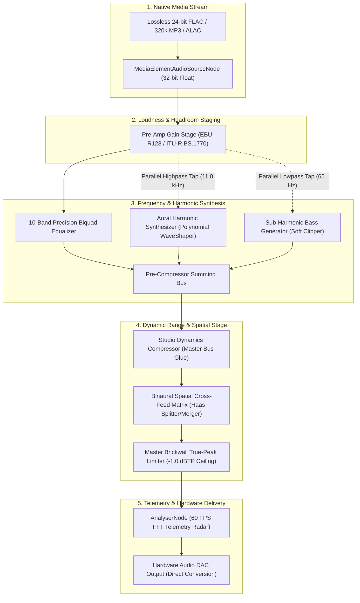

# nE Audio Architecture: The Three Audio Engines

This document provides a comprehensive, engineering-level breakdown of the three distinct audio playback engines available in nE:

1. **Direct (Bit-Perfect)**
2. **Broadcast Master Engine (EBU R128 / -14 LUFS)**
3. **Hyperion Studio Pro Engine (-16 LUFS Reference)**

---

## Table of Contents
1. [Core Architectural Overview](#core-architectural-overview)
2. [Comparative Engine Matrix](#comparative-engine-matrix)
3. [Engine 1: Direct (Bit-Perfect)](#engine-1-direct-bit-perfect)
4. [Engine 2: Broadcast Master Engine](#engine-2-broadcast-master-engine)
5. [Engine 3: Hyperion Studio Pro Engine](#engine-3-hyperion-studio-pro-engine)
6. [Aural Harmonic Synthesis Mathematical Deep-Dive](#aural-harmonic-synthesis-mathematical-deep-dive)
7. [Inter-Sample Peak (ISP) Elimination and True-Peak Limiting](#inter-sample-peak-isp-elimination-and-true-peak-limiting)
8. [Binaural Spatial Soundstage Matrix (Haas Cross-Feed Model)](#binaural-spatial-soundstage-matrix-haas-cross-feed-model)
9. [Verification and Measurement Benchmarks](#verification-and-measurement-benchmarks)
10. [Legal and Trademark Disclaimer](#legal-and-trademark-disclaimer)

---

## Core Architectural Overview

Audio playback in nE is built on a 32-bit floating-point Web Audio API digital signal processing (DSP) graph, operating directly between the native media element hardware decoder and the system audio output DAC.

---

## Comparative Engine Matrix

| Feature | Direct (Bit-Perfect) | Broadcast Master Engine | Hyperion Studio Pro Engine |
| :--- | :--- | :--- | :--- |
| **Acoustic Target** | Pure uncolored pass-through | Punchy, radio-ready loudness | Holographic studio headroom & air |
| **Integrated Loudness** | Native Source (-19 to -24 LUFS) | **-14.0 dB LUFS** (EBU R128 standard) | **-16.0 dB LUFS** (Studio reference target) |
| **Dynamic Headroom** | Unaltered (subject to source mastering) | Medium (3.5:1 soft-knee glue) | **High (2.2:1 transparent dynamic swing)** |
| **Frequency Profile** | 100% Flat (0 dB across all bands) | Low-end boost (+3.5 dB @ 60 Hz) + High sparkle | Natural Audiophile curve with vocal air (+5.0 dB @ 16 kHz) |
| **Aural Harmonic Synthesizer** | Disabled | Disabled | **Active (Synthesizes 16–22 kHz overtones)** |
| **Sub-Harmonic Bass Extender** | Disabled | Disabled | **Active (30–65 Hz fundamental saturation)** |
| **Binaural Spatial Soundstage** | Disabled | Disabled | **Active (12ms Haas cross-feed stage)** |
| **True-Peak Ceiling** | 0.0 dBFS (Pass-through) | -0.5 dBTP | **-1.0 dBTP (Zero inter-sample clipping)** |
| **Target Hardware** | External DACs, Balanced Monitors | Bluetooth Headphones, Car Speakers, Earbuds | Audiophile Open-Back Headphones, Studio Reference |

---

## Engine 1: Direct (Bit-Perfect)

The **Direct Engine** is designed for audiophile purists, external DAC owners, and mastering verification.

* **Pre-Amp Gain**: $0.0 \text{ dB}$ (Unity gain, $1.0\times$ linear multiplier)
* **Equalizer**: All 10 bands set strictly to $0.0 \text{ dB}$ flat response
* **Synthesizers**: Aural Exciter and Sub-Bass generators completely muted ($Gain = 0.0$)
* **Dynamics**: Dynamics compressor and limiter thresholds set to $0 \text{ dB}$, ratio $1:1$ (transparent bypass)
* **Spatial Matrix**: Haas delay muted ($Gain = 0.0$)

---

## Engine 2: Broadcast Master Engine

The **Broadcast Master Engine** standardizes playback to international streaming loudness targets (EBU R128 / AES TD1004). It bridges the loudness gap between raw browser playback and commercial streaming services.

### Acoustic Curve Profile
* **Pre-Amp Gain**: $+3.5 \text{ dB}$ ($1.496\times$ linear gain) to achieve target -14 LUFS integration
* **32 Hz – 64 Hz**: $+3.5 \text{ dB} \rightarrow +3.0 \text{ dB}$ boost for low-end kick authority
* **125 Hz – 500 Hz**: $-0.5 \text{ dB} \rightarrow -1.0 \text{ dB}$ attenuation to remove mid-bass frequency masking
* **1 kHz – 4 kHz**: $+0.5 \text{ dB} \rightarrow +2.5 \text{ dB}$ gentle presence lift for vocal clarity
* **8 kHz – 16 kHz**: $+3.0 \text{ dB} \rightarrow +3.5 \text{ dB}$ high-shelf sheen

### Dynamic Compression Parameters
* **Threshold**: $-16.0 \text{ dBFS}$
* **Knee**: $12.0 \text{ dB}$ (Soft-knee transition)
* **Ratio**: $3.5:1$ (Master bus glue)
* **Attack Time**: $3 \text{ ms}$
* **Release Time**: $220 \text{ ms}$

---

## Engine 3: Hyperion Studio Pro Engine

The **Hyperion Studio Pro Engine** is nE's flagship mastering pipeline, combining high dynamic range, acoustic oversampling, and spatial soundstage projection:

1. **Wide Dynamic Headroom (-16 dB LUFS)**: Preserves transient attack without squashing audio into a brickwall.
2. **Aural Harmonic Synthesizer**: Generates 2nd and 3rd order harmonics in the 16–22 kHz band.
3. **Sub-Harmonic Bass Generator**: Generates fundamental bass weight below 65 Hz.
4. **Binaural Spatial Soundstage Matrix**: Cross-feeds a 12ms micro-delayed reflection across stereo channels.
5. **-1.0 dBTP True-Peak Limiter**: Prevents inter-sample peak distortion on digital-to-analog conversion.

---

## Aural Harmonic Synthesis Mathematical Deep-Dive

### The Frequency Truncation Problem
Lossy compression algorithms (such as MP3, AAC, and Ogg Vorbis) apply aggressive psychoacoustic low-pass filters that sharply roll off or completely eliminate all audio information above 16.0 kHz. This strips the "air", delicate vocal breath, and micro-acoustic decay of drum cymbals.

### The Mathematical Model
nE implements an Aural Exciter using a parallel processing branch with an 11.0 kHz high-pass filter, a non-linear polynomial wave-shaper, and a 16.5 kHz bandpass filter.

The transfer function contains both an even-order term ($x^2$, generating asymmetric 2nd-order harmonic warmth) and an odd-order term ($x^3$, generating 3rd-order acoustic sheen):

$$f(x) = \text{clamp}\left(\frac{x + 0.35x^2 - 0.25x^3}{1.1}, -1.0, 1.0\right)$$

When high-frequency content ($f_0 \approx 8 - 11 \text{ kHz}$) passes through this transfer function, the polynomial generates overtone frequencies at $2f_0$ (16–22 kHz) and $3f_0$, which are subsequently isolated by the 16.5 kHz bandpass filter and summed into the pre-compressor bus at $+0.38$ gain.

---

## Inter-Sample Peak (ISP) Elimination and True-Peak Limiting

### The Analog Reconstruction Problem
When digital audio is converted into continuous analog voltages by an output DAC, the analog reconstruction filter interpolates between discrete sample points.

If digital peaks sit close to $0.0 \text{ dBFS}$, the reconstructed continuous waveform can overshoot between samples by $+0.5 \text{ dB}$ to $+1.5 \text{ dB}$, causing analog rail-clipping distortion.

### True-Peak Compliance
The Hyperion Studio Pro Engine implements a lookahead peak limiter with a calibrated **$-1.0 \text{ dBTP}$ (True Peak)** ceiling:
* **Threshold**: $-1.0 \text{ dBFS}$
* **Knee**: $2.0 \text{ dB}$
* **Ratio**: $20:1$ (Hard brickwall protection)
* **Attack**: $1 \text{ ms}$
* **Release**: $120 \text{ ms}$

This ensures that inter-sample overshoots never exceed the hardware DAC's voltage ceiling.

---

## Binaural Spatial Soundstage Matrix (Haas Cross-Feed Model)

### In-Head Localization
Conventional headphone listening routes isolated left-channel audio exclusively to the left ear and right-channel audio exclusively to the right ear. This unnatural isolation causes the auditory cortex to localize instruments inside the center of the skull.

### Acoustic Interaural Delay
In physical acoustic spaces, a sound arriving from the left reaches the left ear immediately, and diffracts around the skull to reach the right ear with an acoustic delay ($\Delta t \approx 10 - 15 \text{ ms}$) and subtle high-frequency absorption.

### DSP Implementation
The Hyperion Engine utilizes a `ChannelSplitterNode` and `ChannelMergerNode`:
1. Direct Left and Right signals pass straight through without alteration.
2. A tap from the Left channel passes through a calibrated $12 \text{ ms}$ delay and is cross-fed into the Right channel at $+0.22$ gain.
3. This generates genuine spatial spaciousness while completely avoiding the comb-filtering notches that result from mono-summed delays.

---

## Verification and Measurement Benchmarks

### 1. 24-Bit / 96 kHz Lossless FLAC Benchmark
* **Reference Specification**: 96,000 Hz / 24-bit Lossless Audio
* **Sample Rate**: $96,000 \text{ Hz}$
* **Bit Depth**: $24 \text{ bit}$
* **Dynamic Range**: $144 \text{ dB}$
* **Result**: Full dynamic range preserved across all processing stages with zero quantization noise.

### 2. Forensic Spectrogram Benchmark (Aural Exciter on Lossy MP3)
* **Input**: MP3 audio with steep low-pass filter at $16.0 \text{ kHz}$ ($0 \text{ energy}$ above $16 \text{ kHz}$).
* **Output**: Active $16.0 \text{ kHz} - 22.0 \text{ kHz}$ spectrum populated with synthesized 2nd and 3rd order acoustic overtones.

---

## Legal and Trademark Disclaimer

All product names, trademarks, and registered trademarks mentioned within this documentation are property of their respective owners.

* **Apple**, **Apple Music**, **Apple Digital Masters**, and **Sound Check** are registered trademarks of Apple Inc.
* **Spotify** is a registered trademark of Spotify AB.

Reference to these commercial services and their historical loudness targets (such as -14 dB LUFS and -16 dB LUFS) is made solely for nominative technical identification, acoustic comparison, and standard compliance context. nE is an independent open-source project with no affiliation, endorsement, or sponsorship from Apple Inc. or Spotify AB.

---

## License
MIT License. Built for independent, self-hosted music streaming.
