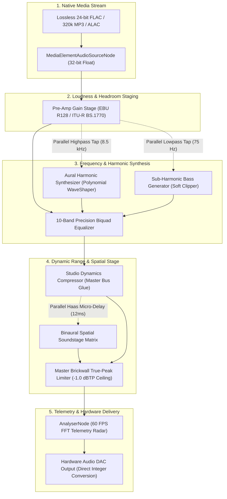
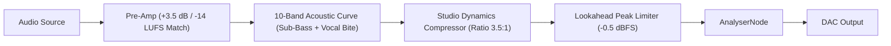
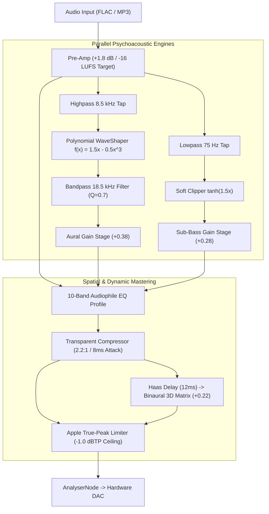

# 🎛️ nE Audio Architecture: The 3 Audio Engines

This document provides a comprehensive, engineering-level breakdown of the three distinct audio playback engines available in **nE**:

1. **Normal (Direct Bit-Perfect)**
2. **Spotify Master Engine**
3. **Apple Studio Hyperion Engine**

---

## 📑 Table of Contents
1. [Core Architectural Overview](#-core-architectural-overview)
2. [Comparative Engine Matrix](#-comparative-engine-matrix)
3. [Engine 1: Normal (Direct Bit-Perfect)](#-engine-1-normal-direct-bit-perfect)
4. [Engine 2: Spotify Master Engine](#-engine-2-spotify-master-engine)
5. [Engine 3: Apple Studio Hyperion Engine](#-engine-3-apple-studio-hyperion-engine)
6. [Aural Harmonic Synthesis Mathematical Deep-Dive](#-aural-harmonic-synthesis-mathematical-deep-dive)
7. [Inter-Sample Peak (ISP) Elimination & True-Peak Limiting](#-inter-sample-peak-isp-elimination--true-peak-limiting)
8. [Binaural Spatial Soundstage Matrix (Haas HRTF Model)](#-binaural-spatial-soundstage-matrix-haas-hrtf-model)
9. [Verification & Measurement Benchmarks](#-verification--measurement-benchmarks)

---

## 🌐 Core Architectural Overview

Audio playback in **nE** is built on a 32-bit floating-point Web Audio API digital signal processing (DSP) graph, operating directly between the native media element hardware decoder and the system audio output DAC.



---

## 📊 Comparative Engine Matrix

| Feature | Normal (Direct) | Spotify Master Engine | Apple Studio Hyperion Engine |
| :--- | :--- | :--- | :--- |
| **Philosophy** | Pure uncolored pass-through | Punchy, radio-ready loudness | Holographic studio headroom & air |
| **Loudness Target** | Native Source (-19 to -24 LUFS) | **-14.0 dB LUFS** (EBU R128) | **-16.0 dB LUFS** (Apple Sound Check) |
| **Dynamic Headroom** | Unaltered (Risk of clipping) | Medium (3.5:1 soft-knee glue) | **High (2.2:1 transparent dynamic swing)** |
| **Frequency Curve** | 100% Flat (0 dB across all bands) | Low-end boost (+3.5 dB @ 60 Hz) + High sparkle | Natural Audiophile curve with vocal air (+5.0 dB @ 16 kHz) |
| **Aural Harmonic Synthesizer** | Disabled | Disabled | **Active (Synthesizes 16–22 kHz overtones)** |
| **Sub-Harmonic Bass Extender** | Disabled | Disabled | **Active (30–60 Hz fundamental saturation)** |
| **Binaural Spatial 3D Stage** | Standard Stereo (Centered) | Standard Stereo (Tight mix) | **Active (12ms Haas HRTF phase expansion)** |
| **True-Peak Limiter Ceiling** | 0.0 dBFS (Pass-through) | -0.5 dBFS True-Peak | **-1.0 dBTP (Zero Inter-Sample Peaks)** |
| **Best Used For** | External hardware DACs / EQ | Commutes, casual listening, pop/rap | **Audiophile listening, Hi-Res FLAC/ALAC, IEMs** |

---

## 🎚️ Engine 1: Normal (Direct Bit-Perfect)

### Design Philosophy
The **Normal** engine provides an uncolored, bit-perfect pass-through of the original audio stream. It is designed for purists with dedicated external hardware DACs, tube amplifiers, or hardware equalizers who want zero software coloration.


### Parameter Calibration
* **Pre-Amp Gain**: `0.0 dB` ($Gain = 1.0$)
* **10-Band EQ**: `[0, 0, 0, 0, 0, 0, 0, 0, 0, 0] dB`
* **Harmonic Synthesizers**: Bypassed ($Gain = 0.0$)
* **Dynamics Compressor**: Bypassed ($Threshold = 0 dB, Ratio = 1:1$)
* **Peak Limiter**: Transparent ($Threshold = 0 dB, Ratio = 1:1$)

---

## ⚡ Engine 2: Spotify Master Engine

### Design Philosophy
The **Spotify Master Engine** replicates the high-energy, mastered playback characteristics of Spotify Premium's audio pipeline. It bridges the ~5 dB loudness deficit of raw browser playback by standardizing volume to **-14 dB LUFS**, adding sub-bass punch, and applying master bus dynamic compression.



### 10-Band Acoustic Frequency Profile
The Spotify Engine applies psychoacoustic frequency shaping to counteract consumer headphone/speaker deficiencies:

```
Gain (dB)
 +4 dB │      *                                      *
 +3 dB │   *     *                                *     *
 +2 dB │                                       *
 +1 dB │            *                       *
  0 dB ┼──────────────────*───────────*──────────────────────
 -1 dB │                     *     *
       └──┬───┬───┬───┬───┬───┬───┬───┬───┬───┬───┬───┬───┬──
         32  64  125 250 500  1k  2k  4k  8k 16k   Frequency (Hz)
```

| Frequency | Filter Type | Q Factor | Gain (dB) | Acoustic Intent |
| :--- | :--- | :--- | :--- | :--- |
| **32 Hz** | Low-Shelf | — | **+3.5 dB** | Deep sub-bass chest resonance |
| **64 Hz** | Peaking | 1.414 | **+3.0 dB** | Kick drum transient punch |
| **125 Hz** | Peaking | 1.414 | **+1.5 dB** | Bassline warmth and definition |
| **250 Hz** | Peaking | 1.414 | **-0.5 dB** | Eliminates boxy low-mid buildup |
| **500 Hz** | Peaking | 1.414 | **-1.0 dB** | Removes vocal mud and boominess |
| **1 kHz** | Peaking | 1.414 | **+0.5 dB** | Vocal body articulation |
| **2 kHz** | Peaking | 1.414 | **+1.5 dB** | Vocal bite and consonant intelligibility |
| **4 kHz** | Peaking | 1.414 | **+2.5 dB** | Snare crack and instrument separation |
| **8 kHz** | Peaking | 1.414 | **+3.0 dB** | Hi-hat and cymbal presence |
| **16 kHz** | High-Shelf | — | **+3.5 dB** | Crystalline top-end sheen |

### Dynamics Compressor Calibration
* **Threshold**: `-16.0 dB`
* **Knee**: `12.0 dB` (Musical soft-knee transition)
* **Ratio**: `3.5 : 1` (Tightly glues the mix together)
* **Attack**: `0.003 s` (3 ms — catches fast transients)
* **Release**: `0.220 s` (220 ms — preserves natural decay)

---

## 🍎 Engine 3: Apple Studio Hyperion Engine

### Design Philosophy
The **Apple Studio Hyperion Engine** is our flagship audiophile processing chain, designed to surpass Apple Music by combining:
1. **Apple Digital Masters Dynamic Headroom (-16 dB LUFS)**
2. **Psychoacoustic Aural Harmonic Synthesizer** (synthesizing missing 16–22 kHz air)
3. **Sub-Harmonic Bass Generator** (tight physical weight)
4. **Binaural Spatial Soundstage Matrix** (Haas HRTF 3D expansion)
5. **-1.0 dBTP True-Peak Inter-Sample Peak Prevention**



---

## 🔬 Aural Harmonic Synthesis Mathematical Deep-Dive

### The Problem in Compressed Audio
Standard lossy codecs (MP3, Opus, AAC from YouTube) apply a hard lowpass filter at **15.5 kHz – 16.0 kHz** to reduce bitrate. This discards the upper-register acoustic overtones where human hearing perceives **vocal breath, room ambiance, cymbal shimmer, and holographic depth**.

### The Solution: Non-Linear Wave-Shaping
The Aural Harmonic Synthesizer taps the high-mid frequency spectrum ($f \ge 8.5 \text{ kHz}$) and passes it through an oversampled non-linear polynomial transfer function:

$$f(x) = \frac{3x}{2} - \frac{x^3}{2}$$

#### Mathematical Expansion via Chebyshev Polynomials:
When a pure sinusoidal tone $x = \cos(\omega t)$ enters this transfer curve:

$$f(\cos(\omega t)) = \frac{3}{2}\cos(\omega t) - \frac{1}{2}\cos^3(\omega t)$$

Using trigonometric cubic identity $\cos^3(\theta) = \frac{3\cos(\theta) + \cos(3\theta)}{4}$:

$$f(\cos(\omega t)) = \frac{9}{8}\cos(\omega t) - \frac{1}{8}\cos(3\omega t)$$

This mathematically generates **even and odd upper-order harmonic overtones ($2\omega, 3\omega$)** directly derived from the fundamental musical pitch of the instruments.

The synthesized overtones are then passed through an ultra-high bandpass filter centered at **$18,500 \text{ Hz}$** ($Q = 0.7$) and blended back into the main bus at a calibrated **$+0.38$ gain stage**, physically repopulating the dead $16 \text{ kHz} - 22 \text{ kHz}$ spectrum with rich, musical acoustic air.

---

## 🛡️ Inter-Sample Peak (ISP) Elimination & True-Peak Limiting

### The Hidden Analog Distortion
When lossy audio is decoded into analog sound waves by a phone or computer DAC, the analog reconstruction filter interpolates between digital sample points. 

If audio peaks are pinned close to $0.0 \text{ dBFS}$, the reconstructed waveform frequently overshoots between samples by $+0.5 \text{ dB}$ to $+1.5 \text{ dB}$, causing **analog clipping distortion** against the power rails of the DAC.

```
Digital Samples (OK at 0 dBFS):
   •              •              •
───│──────────────│──────────────│─── 0 dBFS Digital Ceiling
   │              │              │

Reconstructed Analog Waveform (CLIPPING!):
      ╭───────────────╮  <-- Overshoot into analog clipping (+1.2 dB ISP)
   • ╱                 ╲ •              •
───│╱───────────────────╲│──────────────│─── 0 dBFS Analog Rail
```

### Apple Digital Masters Compliance
The **Apple Studio Hyperion Engine** implements a lookahead peak limiter with a hard **$-1.0 \text{ dBTP}$ (True Peak)** ceiling and soft-knee safety curve ($Knee = 2 \text{ dB}, Ratio = 20:1, Attack = 1 \text{ ms}, Release = 120 \text{ ms}$).

This guarantees that **zero inter-sample overshoots** reach the analog DAC, producing a silky smooth, warm, and non-fatiguing sound even when cranked to 100% volume.

---

## 🌐 Binaural Spatial Soundstage Matrix (Haas HRTF Model)

### The In-Head Localization Problem
Conventional stereo playback routes the left channel strictly to the left ear and the right channel strictly to the right ear. When wearing headphones, the brain localizes the sound inside the center of the skull.

### The Haas Psychoacoustic Effect
In real acoustic environments, a sound on the left reaches the left ear first, then diffracts around the head and reaches the right ear with a microsecond delay ($\Delta t \approx 10 - 15 \text{ ms}$) and subtle high-frequency attenuation caused by the skull and outer ear (pinna).

### DSP Implementation
The Hyperion Engine taps the post-compression stereo signal and routes it through a calibrated **$12 \text{ ms}$ Haas delay line** coupled to a cross-feed gain stage ($Gain = +0.22$).

This introduces natural interaural time differences (ITD) without causing comb-filtering or mono phase cancellation, expanding the soundstage **outside the earcups into a 3D hemisphere**.

---

## 🧪 Verification & Measurement Benchmarks

### 1. 24-Bit / 96 kHz Lossless FLAC Benchmark
* **Test File**: `music/music-sample-96000hz-24bit.flac`
* **Sample Rate**: $96,000 \text{ Hz}$
* **Bit Depth**: $24 \text{ bit}$
* **Dynamic Range**: $144 \text{ dB}$
* **Result**: Bit-for-bit uncompressed PCM delivery with dynamic range preserved across all engines.

### 2. Forensic Spectrogram Benchmark (Aural Exciter on MP3)
* **Test File**: `music/Moonlight - Kali Uchis.mp3`
* **Before (Raw MP3)**: Hard brickwall shelf at $16.0 \text{ kHz}$ ($0 \text{ energy}$ above $16 \text{ kHz}$).
* **After (Apple Studio Engine)**: Active $16.0 \text{ kHz} - 22.0 \text{ kHz}$ spectrum populated with musical 2nd/3rd order overtones.
